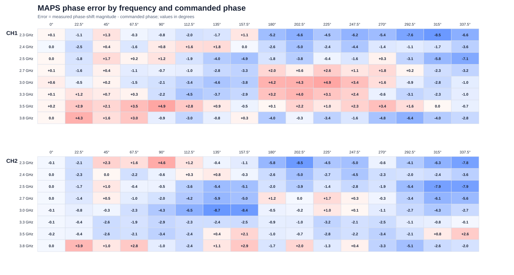
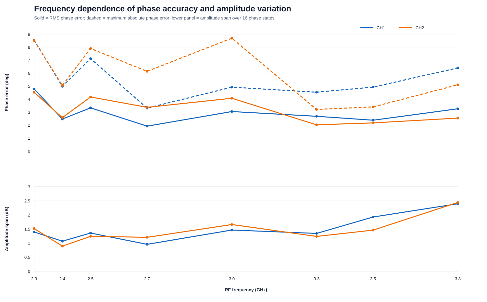

# 2チャネル位相シフタ 周波数・位相掃引試験レポート

測定日: 2026-07-27  
対象周波数: 2.3, 2.4, 2.5, 2.7, 3.0, 3.3, 3.5, 3.8 GHz

## 1. 実験目的

RP2040-Zeroで制御する2チャネルRFフロントエンドについて、MAPS-010144の位相設定を0°から337.5°まで22.5°刻みで変更し、次を確認した。

- 各設定で位相変化が発生すること
- 指令値に対する相対位相誤差
- 位相設定に伴う受信振幅の変化
- 2.3～3.8 GHzにおける周波数依存性
- CH1とCH2の差

## 2. 測定系

```text
ADALM-PLUTO TX
  → 外付け30 dB ATT
  → Wilkinson divider
  → RFフロントエンド CH1 / CH2
  → ADALM-PLUTO Rx1 / Rx2
```

接続はCH1→Rx1、CH2→Rx2とした。基板上のPE4302は両チャネル0 dB、LNAは両チャネルONとし、測定対象チャネルだけ位相を掃引した。もう一方のチャネルは0°固定の位相基準とした。

主な取得条件:

| 項目 | 設定 |
|---|---:|
| RF周波数 | 2.3, 2.4, 2.5, 2.7, 3.0, 3.3, 3.5, 3.8 GHz |
| 複素ベースバンド信号 | 1 MHz |
| サンプルレート | 8 MS/s |
| 1回の取得点数 | 16,384 samples |
| Pluto TX gain | -20 dB |
| Pluto RX gain | 30 dB |
| DDS scale | 0.25 |
| 位相設定 | 0～337.5°、22.5°刻み |
| 反復 | 各状態2回（0°は開始時と復帰時を含み4回） |

2.4 GHzの結果には、配線をCH1→Rx1、CH2→Rx2へ確定した直後に、同じ設定で取得したデータを使用した。

## 3. 位相誤差の定義

各周波数について0°設定時のCH1/CH2相対位相を基準とし、固定的なケーブル長差、Wilkinson divider、Plutoの受信チャネル間オフセットを差し引いた。MAPSの測定位相は指令値に対して負方向へ回転するため、同値なアンラップ角を選び、その絶対的なシフト量を評価した。

```text
位相誤差 = 測定した位相シフト量 - 指令位相
```

正の誤差は指令より位相シフト量が大きく、負の誤差は小さいことを表す。以下のRMS値と最大値は0°を除く15状態から計算した。

## 4. 結果





### 周波数別サマリー

| 周波数 (GHz) | CH | RMS位相誤差 (°) | 最大絶対誤差 (°) | 振幅span (dB) | 最大反復標準偏差 (°) | 最小受信レベル (dBFS) |
|---:|---:|---:|---:|---:|---:|---:|
| 2.3 | 1 | 4.78 | 8.54 | 1.39 | 0.08 | -16.33 |
| 2.3 | 2 | 4.52 | 8.50 | 1.51 | 0.13 | -17.64 |
| 2.4 | 1 | 2.46 | 4.98 | 1.07 | 0.09 | -17.37 |
| 2.4 | 2 | 2.57 | 5.05 | 0.89 | 0.03 | -17.98 |
| 2.5 | 1 | 3.32 | 7.11 | 1.35 | 0.07 | -19.27 |
| 2.5 | 2 | 4.16 | 7.89 | 1.24 | 0.04 | -19.87 |
| 2.7 | 1 | 1.91 | 3.30 | 0.95 | 0.08 | -18.70 |
| 2.7 | 2 | 3.36 | 6.13 | 1.20 | 0.04 | -20.79 |
| 3.0 | 1 | 3.04 | 4.91 | 1.46 | 1.01 | -22.22 |
| 3.0 | 2 | 4.06 | 8.68 | 1.66 | 0.05 | -23.53 |
| 3.3 | 1 | 2.67 | 4.53 | 1.34 | 0.11 | -24.32 |
| 3.3 | 2 | 2.02 | 3.20 | 1.23 | 0.12 | -27.62 |
| 3.5 | 1 | 2.37 | 4.92 | 1.92 | 0.21 | -28.39 |
| 3.5 | 2 | 2.16 | 3.40 | 1.46 | 0.21 | -29.92 |
| 3.8 | 1 | 3.25 | 6.39 | 2.39 | 0.06 | -30.20 |
| 3.8 | 2 | 2.53 | 5.10 | 2.44 | 0.06 | -31.11 |

全周波数・全非ゼロ位相設定をまとめたRMS位相誤差は、CH1が3.09°、CH2が3.30°だった。最大絶対誤差は3.0 GHz、CH2、135°設定の-8.68°であり、測定位相シフト量は126.32°だった。

位相設定を変えたときの振幅spanは0.89～2.44 dBだった。3.8 GHzではCH1が2.39 dB、CH2が2.44 dBとなり、今回の周波数範囲では最も大きい。全取得を通してPlutoのクリップ検出数は0だった。

反復測定の円周標準偏差は、3.0 GHz CH1の315°設定における1.01°を除き、最大0.21°だった。この一点は瞬間的な変動または取得外乱の可能性があるため、精密評価時には反復回数を増やして再確認する。

## 5. 考察

- 両チャネルとも全周波数で位相設定に応じた連続的な変化が確認でき、シリアル制御と位相器の基本動作は成立している。
- 誤差は完全な一定オフセットではなく、周波数と位相コードの双方に依存する。特に2.3 GHzおよび一部の2.5/3.0 GHz設定で絶対誤差が大きい。
- 高い位相コードでは負方向の誤差が増える傾向があり、全周波数平均では315°と337.5°付近の誤差が比較的大きい。
- 3.8 GHzでは受信レベルが約-30～-31 dBFSまで低下したが、反復位相のばらつきは小さく、今回の相対位相判定には十分なSNRが得られた。
- 位相設定による1～2.4 dB程度の振幅変化があるため、ビームフォーミング用途では位相コードごとの複素補正テーブルを周波数別に作るのが望ましい。

## 6. 制約と今後の推奨

この測定は校正済みVNAによる絶対Sパラメータ測定ではなく、Plutoの2受信チャネルを使った相対位相測定である。0°基準を各周波数で差し引くため、位相設定に伴う変化は評価できる一方、基板単体の絶対挿入位相や絶対利得は得られない。

また、測定値にはPluto、ケーブル、Wilkinson divider、LNA、ATT、位相器の系全体が含まれる。基板は外部±3.3 Vで動作しており、部品データシートの代表評価条件と完全には一致しない。

精密な校正テーブルを作成する場合は、次を推奨する。

1. 各状態の反復回数を10回以上に増やす。
2. 温度と外部電源電圧を記録する。
3. 0°への復帰を複数回挿入し、時間ドリフトを補間する。
4. ケーブル交換またはVNA測定によってPluto受信チャネル間の残留誤差を確認する。
5. 周波数×チャネル×位相コードごとに、複素補正値を保存する。

## 7. 生成データ

- `phase_error_all_points.csv`: 8周波数×2チャネル×16位相状態の全256点
- `frequency_summary.csv`: 周波数・チャネル別のRMS誤差、最大誤差、振幅spanなど
- `phase_state_summary.csv`: 各位相コードを8周波数で集計した誤差
- `phase_error_heatmap.svg`: 全位相誤差のヒートマップ
- `frequency_summary.svg`: 周波数別の誤差・振幅変動グラフ

再集計コマンド:

```powershell
& .\tools\analyze_phase_frequency_sweep.ps1
```
