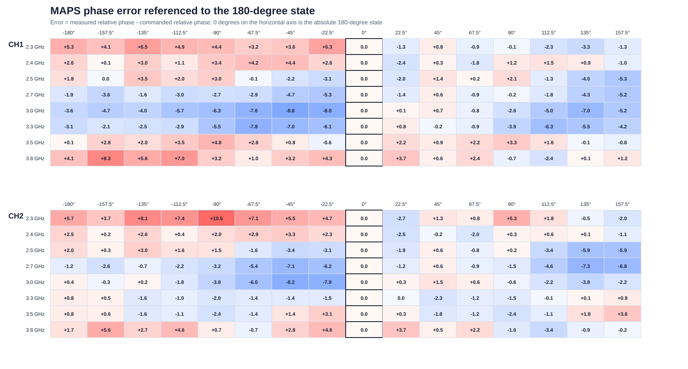
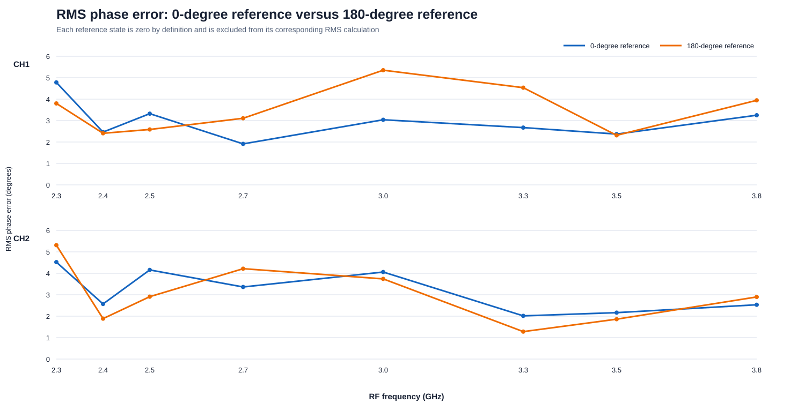

# 180°基準 相対位相誤差解析

解析日: 2026-07-28  
入力データ: 2026-07-27に取得した2.3～3.8 GHz、2チャネル、全16位相状態の複素位相測定

## 1. 目的

従来の0°状態基準に加え、各周波数・各チャネルの180°状態を位相中心として、-180°から+157.5°までの相対位相誤差を評価した。

今回は再測定ではなく、同じ複素位相測定値を180°状態へ数学的にリファレンスし直した。したがって、0°基準と180°基準の差は測定時刻やPluto設定の違いによるものではない。

## 2. 計算方法

絶対指令位相を `C`、0°基準で測定した位相シフト量を `M(C)` とすると、

```text
180°からの相対指令位相 = C - 180°
180°からの相対測定位相 = M(C) - M(180°)
180°基準の誤差
  = [M(C) - M(180°)] - [C - 180°]
  = 0°基準の誤差(C) - 0°基準の誤差(180°)
```

このため180°状態自身の誤差は定義上0°となる。一方、180°状態が0°基準に対して持っていた誤差が、ほかの全状態から差し引かれる。

## 3. 全状態の結果



横軸0°が絶対位相設定180°に相当する。左側は180°より小さい設定、右側は180°より大きい設定である。

## 4. 0°基準との比較



| 周波数 (GHz) | CH | RMS誤差・180°基準 (°) | 最大絶対誤差 (°) | 最悪の絶対設定 | 180°からの相対設定 | RMS誤差・0°基準 (°) |
|---:|---:|---:|---:|---:|---:|---:|
| 2.3 | 1 | 3.80 | 6.53 | 45° | -135° | 4.78 |
| 2.3 | 2 | 5.31 | 10.47 | 90° | -90° | 4.52 |
| 2.4 | 1 | 2.41 | 4.39 | 135° | -45° | 2.46 |
| 2.4 | 2 | 1.88 | 3.31 | 135° | -45° | 2.57 |
| 2.5 | 1 | 2.58 | 5.31 | 337.5° | +157.5° | 3.32 |
| 2.5 | 2 | 2.91 | 5.88 | 315° | +135° | 4.16 |
| 2.7 | 1 | 3.11 | 5.26 | 157.5° | -22.5° | 1.91 |
| 2.7 | 2 | 4.22 | 7.32 | 315° | +135° | 3.36 |
| 3.0 | 1 | 5.35 | 8.78 | 135° | -45° | 3.04 |
| 3.0 | 2 | 3.74 | 8.18 | 135° | -45° | 4.06 |
| 3.3 | 1 | 4.53 | 7.76 | 112.5° | -67.5° | 2.67 |
| 3.3 | 2 | 1.28 | 2.26 | 225° | +45° | 2.02 |
| 3.5 | 1 | 2.31 | 4.84 | 90° | -90° | 2.37 |
| 3.5 | 2 | 1.86 | 3.60 | 337.5° | +157.5° | 2.16 |
| 3.8 | 1 | 3.94 | 8.32 | 22.5° | -157.5° | 3.25 |
| 3.8 | 2 | 2.90 | 5.59 | 22.5° | -157.5° | 2.53 |

全周波数をまとめた180°基準RMS誤差は、CH1が3.65°、CH2が3.27°だった。最大絶対誤差は2.3 GHz、CH2、絶対90°設定の+10.47°である。

## 5. 解釈

0°基準で大きく見えていた高位相コードの一部は、180°基準では小さくなった。例として2.3 GHzでは次のようになる。

| CH | 絶対設定 | 180°からの相対設定 | 0°基準誤差 | 180°基準誤差 |
|---:|---:|---:|---:|---:|
| 1 | 315° | +135° | -8.54° | -3.29° |
| 1 | 337.5° | +157.5° | -6.60° | -1.35° |
| 2 | 315° | +135° | -6.32° | -0.49° |
| 2 | 337.5° | +157.5° | -7.85° | -2.01° |

これは、2.3 GHzの180°状態自身が0°基準でCH1=-5.25°、CH2=-5.84°の誤差を持っていたためである。180°を基準にすると、この共通するずれが高位相側から除去される。

ただし、基準を変更して位相器そのものの精度が改善したわけではない。180°状態の誤差が全状態へ移されるため、別の設定では誤差が増える。例えば2.3 GHz CH2の90°設定は、0°基準では+4.63°だが、180°基準では+10.47°となった。

したがって、ビームフォーミングで主に180°近傍の相対位相を使用するなら180°基準が便利だが、位相器全体の性能指標としては、データシートと同じ0°基準RMSも併記するのが適切である。

## 6. 出力ファイル

- `phase_error_reference_180_all_points.csv`: 全256点の180°基準相対位相
- `frequency_summary_reference_180.csv`: 周波数・チャネル別の集計
- `phase_error_reference_180_heatmap.svg`: 180°中心の誤差ヒートマップ
- `rms_reference_comparison.svg`: 0°基準と180°基準のRMS比較

再計算:

```powershell
& .\tools\analyze_phase_reference_180.ps1
```
